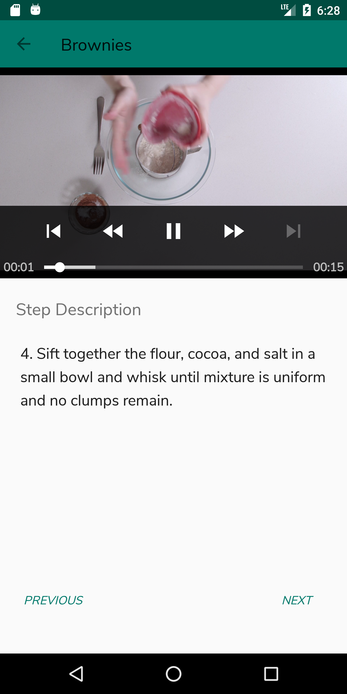

# BakingApp
Udacity Android developer Nanodegree project

## Description
Baking app allow Udacity’s resident baker-in-chief, Miriam, to share her recipes with the world. The app allow a user to select a recipe and see video-guided steps for how to complete it.

## Librairies Used
* [Retrofit](https://square.github.io/retrofit/).
* [ButterKnife](jakewharton.github.io/butterknife/)
* [Picasso](square.github.io/picasso/)
* [DataBinding](https://developer.android.com/topic/libraries/data-binding)
* [Gson](github.com/google/gson)
* [ExoPlayer](github.com/google/exoplayer)
* [Espresso testing](https://developer.android.com/training/testing/espresso/)

## Requirements
* Android Studio
* Android SDK & tools version 28

## Screenshots
<h4 align="center">

